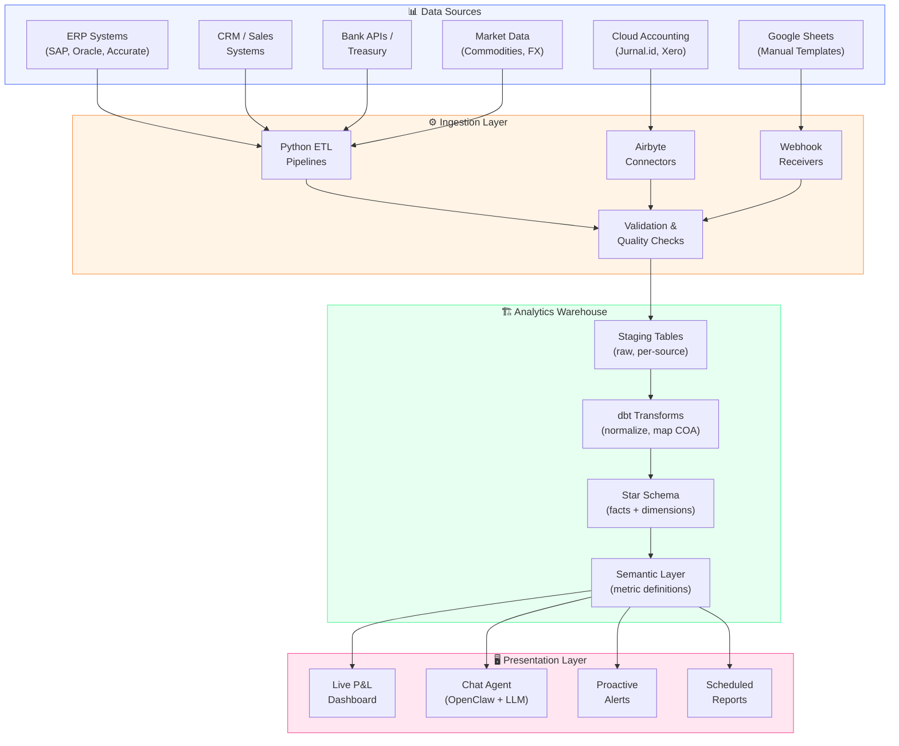
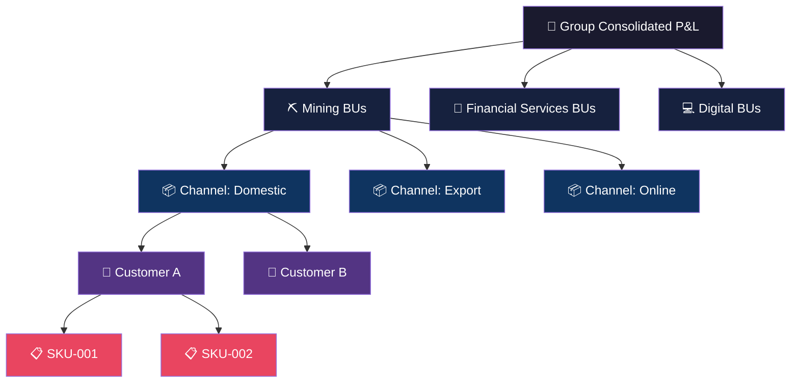
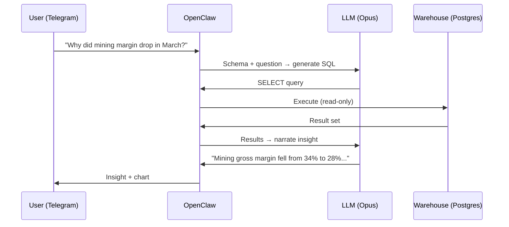

# CFO Brain 🧠

**Group CFO Command Center** — Live P&L dashboards with conversational AI analytics.

> From raw accounting data to "Why did margin drop last month?" in one platform.

## What This Is

A unified system that:
1. **Ingests** financial data from multiple business units (ERPs, spreadsheets, APIs)
2. **Normalizes** into a single analytical warehouse with consistent metrics
3. **Visualizes** via drill-down P&L dashboards (Group → BU → Channel → Customer → SKU)
4. **Answers questions** via natural language through an AI agent (OpenClaw integration)
5. **Alerts proactively** when margins compress, budgets miss, or anomalies appear

## Architecture Overview



## Dashboard Drill-Down Hierarchy



## Conversational Agent Flow



## Project Structure

```
cfo-brain/
├── README.md                    # This file
├── docs/
│   ├── architecture.md          # Detailed system architecture
│   ├── dashboard-template.md    # P&L dashboard design decisions
│   ├── data-model.md            # Star schema & dimension design
│   ├── agent-design.md          # Conversational agent architecture
│   ├── ingestion-guide.md       # How data flows in
│   └── decisions/               # Architecture Decision Records
│       └── 001-warehouse-choice.md
├── templates/
│   ├── pnl-template.md          # P&L line item structure
│   └── bu-onboarding.md         # Checklist for adding a new BU
├── scripts/
│   ├── ingestion/               # ETL scripts per source
│   └── queries/                 # Reference SQL queries
├── skills/
│   └── cfo-query/               # OpenClaw agent skill
│       ├── SKILL.md
│       ├── schema.md
│       ├── examples.md
│       ├── scripts/
│       └── references/
└── dashboard/                   # Next.js dashboard app (future)
```

## Build Phases

| Phase | Timeline | What Ships |
|-------|----------|------------|
| **0 — Data Audit** | Week 1 | Source inventory, access map, COA gaps identified |
| **1 — Warehouse** | Weeks 2-3 | Schema deployed, first BU data flowing |
| **2 — Dashboard v0** | Weeks 4-5 | Group + BU P&L with drill-down |
| **3 — Agent v0** | Weeks 6-7 | Text-to-SQL queries via Telegram |
| **4 — Full Dashboard** | Weeks 7-8 | All 5 levels, charts, budget vs actual |
| **5 — Automation** | Weeks 9-10 | Scheduled reports, proactive alerts |

## Key Documents

- [📐 Architecture Deep Dive](docs/architecture.md)
- [📊 Dashboard Template Decisions](docs/dashboard-template.md)
- [🗄️ Data Model & Schema](docs/data-model.md)
- [🤖 Agent Design](docs/agent-design.md)
- [📥 Ingestion Guide](docs/ingestion-guide.md)

---

*Built for the Group CFO who'd rather ask a question than open a spreadsheet.*
