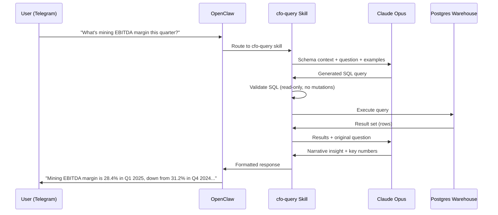
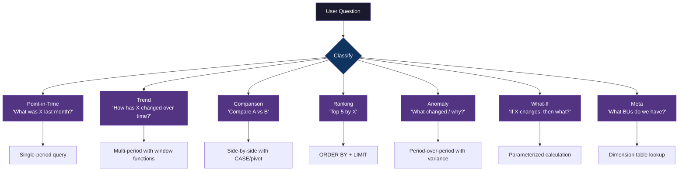
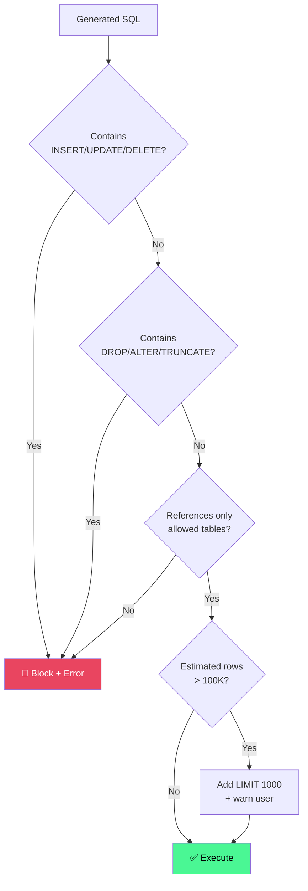
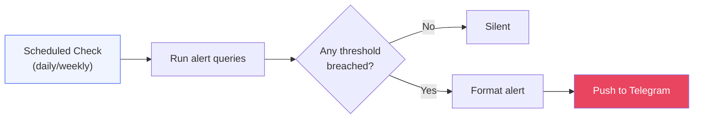

# 🤖 Conversational Agent Design

## Overview

The CFO Brain agent lets you query financial data in natural language through Telegram (via OpenClaw). Ask a question, get an answer with data — no dashboard clicking required.



---

## Query Classification

The agent should handle these query types:



---

## Example Queries & Expected SQL

### Point-in-Time
**User:** "What was BU Mining's revenue last month?"

```sql
SELECT
    SUM(f.amount_idr) AS revenue
FROM fact_pnl_line_item f
JOIN dim_business_unit bu ON f.bu_id = bu.bu_id
JOIN dim_date d ON f.date_id = d.date_id
JOIN dim_account a ON f.account_id = a.account_id
WHERE bu.bu_code = 'MINING'
  AND a.line_item_type = 'REVENUE'
  AND d.year = 2025 AND d.month = 3;
```

### Trend
**User:** "Show me EBITDA trend for all BUs, last 6 months"

```sql
SELECT
    bu.bu_name,
    d.year,
    d.month,
    SUM(CASE WHEN a.line_item_type IN ('REVENUE', 'COGS', 'OPEX') THEN f.amount_idr ELSE 0 END) AS ebitda
FROM fact_pnl_line_item f
JOIN dim_business_unit bu ON f.bu_id = bu.bu_id
JOIN dim_date d ON f.date_id = d.date_id
JOIN dim_account a ON f.account_id = a.account_id
WHERE d.calendar_date >= CURRENT_DATE - INTERVAL '6 months'
GROUP BY bu.bu_name, d.year, d.month
ORDER BY bu.bu_name, d.year, d.month;
```

### Comparison
**User:** "Compare domestic vs export channel margins for mining"

```sql
SELECT
    ch.channel_type,
    SUM(CASE WHEN a.line_item_type = 'REVENUE' THEN f.amount_idr ELSE 0 END) AS revenue,
    SUM(CASE WHEN a.line_item_type IN ('REVENUE', 'COGS') THEN f.amount_idr ELSE 0 END) AS gross_profit,
    ROUND(
        SUM(CASE WHEN a.line_item_type IN ('REVENUE', 'COGS') THEN f.amount_idr ELSE 0 END) /
        NULLIF(SUM(CASE WHEN a.line_item_type = 'REVENUE' THEN f.amount_idr ELSE 0 END), 0) * 100
    , 1) AS gross_margin_pct
FROM fact_pnl_line_item f
JOIN dim_business_unit bu ON f.bu_id = bu.bu_id
JOIN dim_channel ch ON f.channel_id = ch.channel_id
JOIN dim_date d ON f.date_id = d.date_id
JOIN dim_account a ON f.account_id = a.account_id
WHERE bu.sector = 'mining'
  AND ch.channel_type IN ('domestic', 'export')
  AND d.year = 2025
GROUP BY ch.channel_type;
```

### Ranking
**User:** "Top 5 customers by revenue growth YTD"

```sql
WITH current_ytd AS (
    SELECT f.customer_id, SUM(f.amount_idr) AS revenue
    FROM fact_pnl_line_item f
    JOIN dim_date d ON f.date_id = d.date_id
    JOIN dim_account a ON f.account_id = a.account_id
    WHERE a.line_item_type = 'REVENUE' AND d.year = 2025
    GROUP BY f.customer_id
),
prior_ytd AS (
    SELECT f.customer_id, SUM(f.amount_idr) AS revenue
    FROM fact_pnl_line_item f
    JOIN dim_date d ON f.date_id = d.date_id
    JOIN dim_account a ON f.account_id = a.account_id
    WHERE a.line_item_type = 'REVENUE' AND d.year = 2024 AND d.month <= EXTRACT(MONTH FROM CURRENT_DATE)
    GROUP BY f.customer_id
)
SELECT
    c.customer_name,
    cur.revenue AS ytd_revenue,
    pri.revenue AS prior_ytd_revenue,
    ROUND((cur.revenue - COALESCE(pri.revenue, 0)) / NULLIF(pri.revenue, 0) * 100, 1) AS growth_pct
FROM current_ytd cur
JOIN dim_customer c ON cur.customer_id = c.customer_id
LEFT JOIN prior_ytd pri ON cur.customer_id = pri.customer_id
ORDER BY growth_pct DESC NULLS LAST
LIMIT 5;
```

### Anomaly Detection
**User:** "Which channel dropped the fastest since January?"

```sql
WITH monthly AS (
    SELECT
        ch.channel_name,
        d.month,
        SUM(CASE WHEN a.line_item_type = 'REVENUE' THEN f.amount_idr ELSE 0 END) AS revenue
    FROM fact_pnl_line_item f
    JOIN dim_channel ch ON f.channel_id = ch.channel_id
    JOIN dim_date d ON f.date_id = d.date_id
    JOIN dim_account a ON f.account_id = a.account_id
    WHERE d.year = 2025
    GROUP BY ch.channel_name, d.month
),
change AS (
    SELECT
        channel_name,
        FIRST_VALUE(revenue) OVER (PARTITION BY channel_name ORDER BY month) AS jan_revenue,
        LAST_VALUE(revenue) OVER (PARTITION BY channel_name ORDER BY month
            RANGE BETWEEN UNBOUNDED PRECEDING AND UNBOUNDED FOLLOWING) AS latest_revenue
    FROM monthly
)
SELECT DISTINCT
    channel_name,
    jan_revenue,
    latest_revenue,
    ROUND((latest_revenue - jan_revenue) / NULLIF(jan_revenue, 0) * 100, 1) AS change_pct
FROM change
ORDER BY change_pct ASC
LIMIT 5;
```

---

## Safety & Guardrails



### Rules

1. **Read-only connection** — agent uses a Postgres role with SELECT-only grants
2. **SQL validation** — regex check for mutation keywords before execution
3. **Table allowlist** — only fact_*, dim_*, v_*, fx_rates tables
4. **Row limit** — auto-add `LIMIT 1000` if no LIMIT present
5. **Timeout** — 10 second query timeout
6. **Audit log** — every query logged with user, question, SQL, result count, execution time

### Response Formatting

| Result Type | Format |
|-------------|--------|
| Single number | Bold number + context sentence |
| Small table (≤10 rows) | Formatted table |
| Large result | Top 10 + "showing 10 of N" |
| Trend data | Bullet list with arrows (↑↓→) |
| Error | "I couldn't answer that — here's why" |

### Confidence Signals

The agent should flag uncertainty:

- **"Based on preliminary data..."** — when period_status = 'preliminary'
- **"Note: BU X hasn't reported for this period yet"** — when data is missing
- **"This excludes [channel/customer] where data isn't available at that granularity"** — when NULLs affect the result

---

## Proactive Insights (Push Mode)

Beyond answering questions, the agent can push alerts:



### Alert Rules

| Alert | Query | Threshold | Frequency |
|-------|-------|-----------|-----------|
| Margin compression | Gross margin MoM by BU | Drop >5 ppt | Daily (after data load) |
| Revenue miss | Actual vs budget by BU | Miss >10% | Weekly |
| Customer concentration | Top customer % of BU revenue | >25% | Monthly |
| Negative margin | Any channel/customer with negative CM | Any occurrence | Daily |
| Data staleness | MAX(loaded_at) per BU | >48 hours | Daily |
| Large variance | Any line item MoM change >50% | >50% | Daily |

### Alert Message Format

```
⚠️ CFO Brain Alert — April 17, 2025

📉 MARGIN COMPRESSION
BU Mining gross margin dropped from 34.1% → 28.7% (Mar → Apr)
Driven by: COGS increase in Direct Materials (+18% MoM)
Action: Review fuel/logistics costs

📊 BUDGET MISS
BU Digital revenue at 72% of monthly budget (IDR 4.2B vs 5.8B target)
YTD attainment: 81%

🔴 NEGATIVE MARGIN
Customer PT Bara Sentosa — negative contribution margin for 3rd consecutive month
Cumulative loss: IDR 890M YTD
```

---

## Skill File Structure

```
skills/cfo-query/
├── SKILL.md              # Skill definition + activation triggers
├── schema.md             # Full warehouse schema (for LLM context)
├── examples.md           # 30+ example question → SQL pairs
├── scripts/
│   ├── query.py          # Execute SQL against warehouse
│   ├── validate.py       # SQL safety checks
│   └── format.py         # Result formatting
└── references/
    ├── metric-defs.md    # What each metric means
    ├── bu-codes.md       # BU names ↔ codes mapping
    └── glossary.md       # Financial terms + IDX-specific jargon
```

---

## Future Enhancements

| Feature | Description | Phase |
|---------|-------------|-------|
| **Chart generation** | Return inline charts (matplotlib → image) | v1.5 |
| **Multi-turn** | "Now show that by channel" (context memory) | v1.5 |
| **Explain mode** | "Show me the SQL" for transparency | v1.0 |
| **Drill-down suggestions** | "Would you like to see this by customer?" | v2 |
| **What-if engine** | Sensitivity analysis on price/volume/FX | v2 |
| **Voice** | Ask via voice message, get audio + text answer | v2 |
| **Board pack generation** | "Generate the monthly board P&L pack as PDF" | v2 |

---

*The agent is only as good as the data behind it. Schema quality and example coverage are the two highest-leverage investments.*
