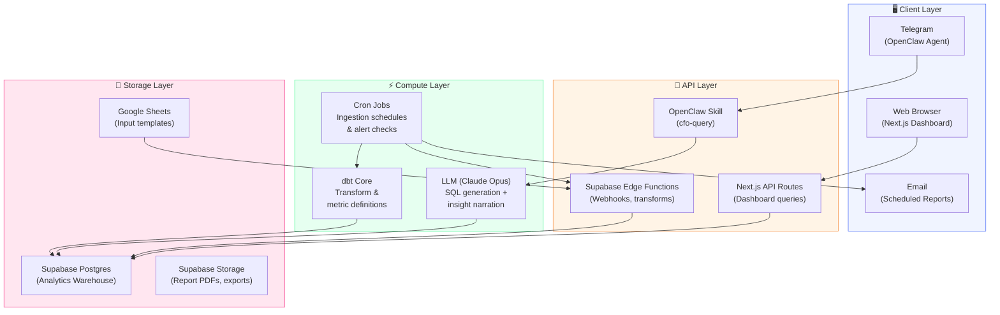
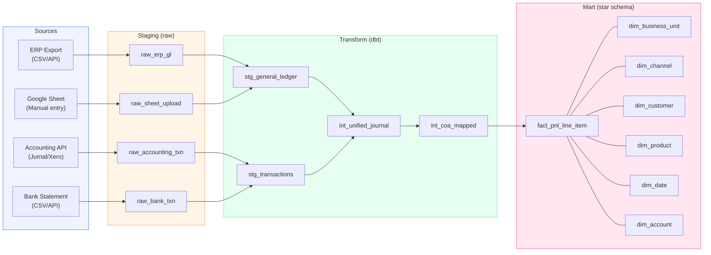
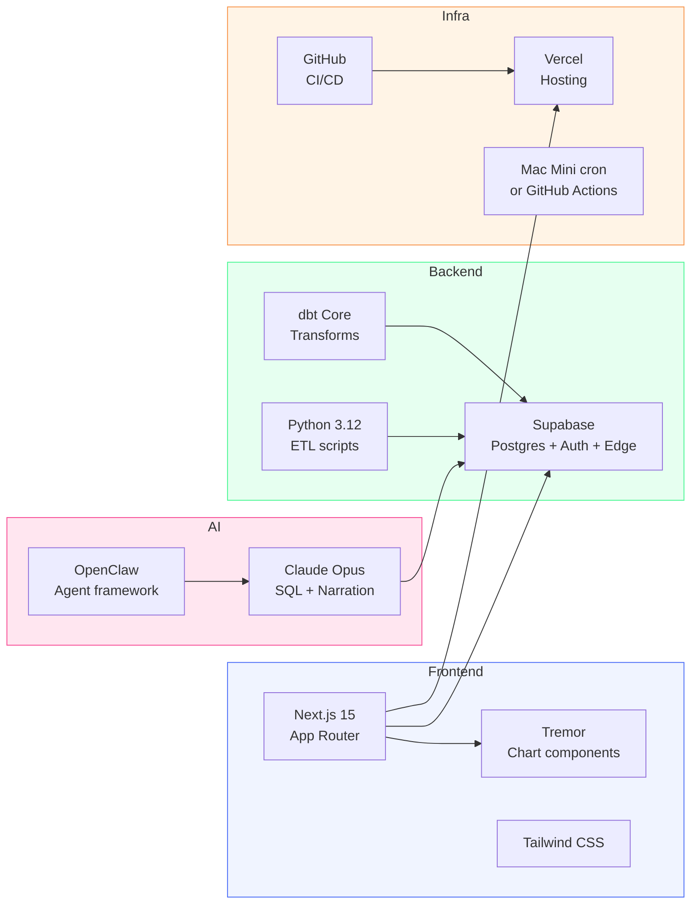
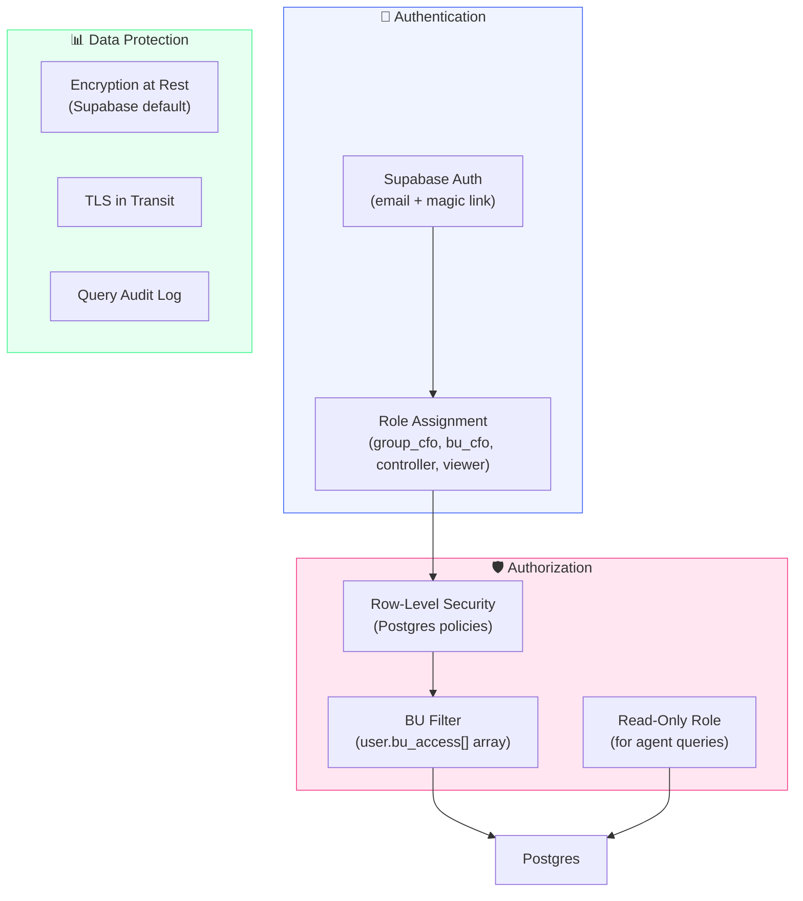
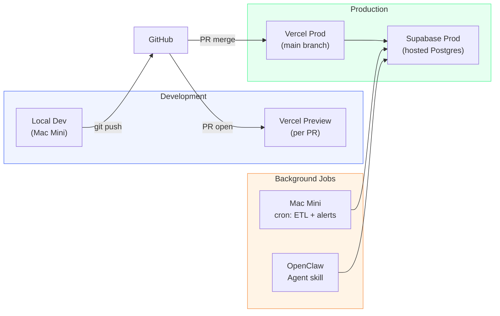

# 📐 Architecture Deep Dive

## System Architecture

### Design Principles

1. **Start lean, scale when needed** — Postgres before ClickHouse, Vercel before AWS
2. **One schema to rule them all** — every BU's data maps to the same star schema
3. **Semantic layer is the API** — dashboards and agents query metrics, not raw tables
4. **Security by default** — RLS at the data layer, not just the UI
5. **Conversational-first** — if you can't ask it in English, the system isn't done

---

## Component Architecture



---

## Data Flow — End to End

### Ingestion Pipelines



### Validation Rules

Every record passes through validation before landing in staging:

| Rule | Action on Fail |
|------|---------------|
| Period is a valid fiscal month | Reject + alert |
| BU code exists in dim_business_unit | Reject + alert |
| Account code maps to COA mapping table | Quarantine + flag |
| Debit = Credit (double-entry check) | Quarantine + flag |
| Amount is within 3σ of historical average | Accept + flag as anomaly |
| Duplicate detection (source_id + period) | Skip (idempotent) |

---

## Tech Stack Details

### Chosen Stack (v1)



### Why These Choices

| Component | Choice | Rationale |
|-----------|--------|-----------|
| **Database** | Supabase Postgres | Known stack, RLS built-in, free tier generous, Edge Functions for webhooks |
| **Transform** | dbt Core | Industry standard, version-controlled SQL, metric definitions |
| **Frontend** | Next.js + Tremor | React ecosystem (known), Tremor = beautiful charts with minimal code |
| **AI** | Claude Opus via OpenClaw | Best judgment for SQL generation, already integrated |
| **Hosting** | Vercel | Known deploy flow, preview URLs per PR |
| **ETL** | Python scripts | Flexible, handles any source format |
| **Scheduling** | Mac Mini cron | Already running 24/7, no extra infra |

### Upgrade Path

| When | Migrate From | Migrate To | Trigger |
|------|-------------|------------|---------|
| >1M rows/month | Postgres | ClickHouse or BigQuery | Query latency >2s on aggregations |
| >10 concurrent users | Vercel Hobby | Vercel Pro | Bandwidth / function limits |
| Complex orchestration | cron scripts | Dagster or Prefect | >10 interdependent pipelines |
| Real-time data needed | Batch ETL | Kafka + streaming | BU provides real-time API |

---

## Security Architecture



### RLS Policy Example

```sql
-- Users can only see P&L data for their assigned BUs
CREATE POLICY "bu_access_policy" ON fact_pnl_line_item
    FOR SELECT
    USING (
        bu_id = ANY(
            SELECT unnest(bu_access)
            FROM user_profiles
            WHERE user_id = auth.uid()
        )
        OR
        EXISTS (
            SELECT 1 FROM user_profiles
            WHERE user_id = auth.uid()
            AND role IN ('group_cfo', 'group_ceo')
        )
    );
```

---

## Deployment Architecture



### Branch Strategy

```
main              → Production (Vercel prod deployment)
staging           → Integration testing (Vercel preview)
feat/*            → Feature branches (PR into staging)
data/bu-*         → BU-specific ingestion work
```

---

## Monitoring & Observability

| What | How | Alert Channel |
|------|-----|---------------|
| ETL pipeline failures | Script exit codes + log files | Telegram via OpenClaw |
| Data freshness | `MAX(loaded_at)` per BU check | Telegram alert if >36h stale |
| Query performance | Postgres `pg_stat_statements` | Log slow queries >2s |
| Dashboard uptime | Vercel analytics | Email |
| Agent query accuracy | Log all generated SQL + results | Weekly review |
| Data quality | dbt tests (not_null, unique, accepted_values) | Telegram alert on failure |

---

## Disaster Recovery

| Scenario | Mitigation |
|----------|------------|
| Supabase outage | Point-in-time recovery (Supabase built-in) |
| Bad data loaded | Reload from staging tables (immutable raw layer) |
| Schema migration breaks | dbt snapshot + migration rollback |
| Dashboard down | Vercel auto-recovery; agent still works via direct DB |
| Mac Mini offline | GitHub Actions as backup scheduler |

---

*Architecture is living documentation. Update this as decisions are made and the system evolves.*
