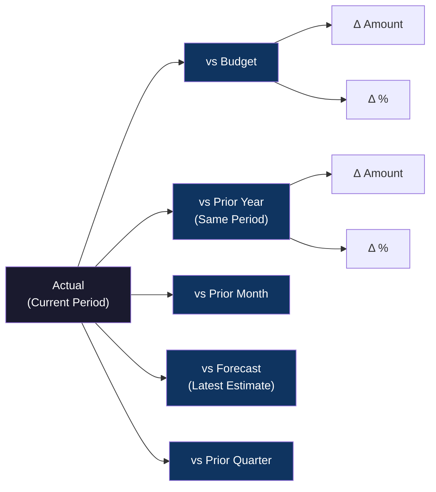
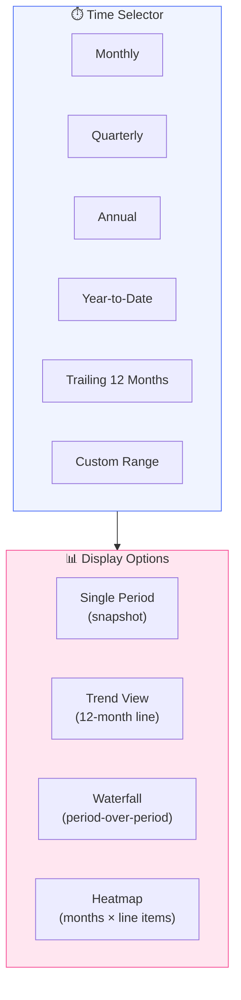
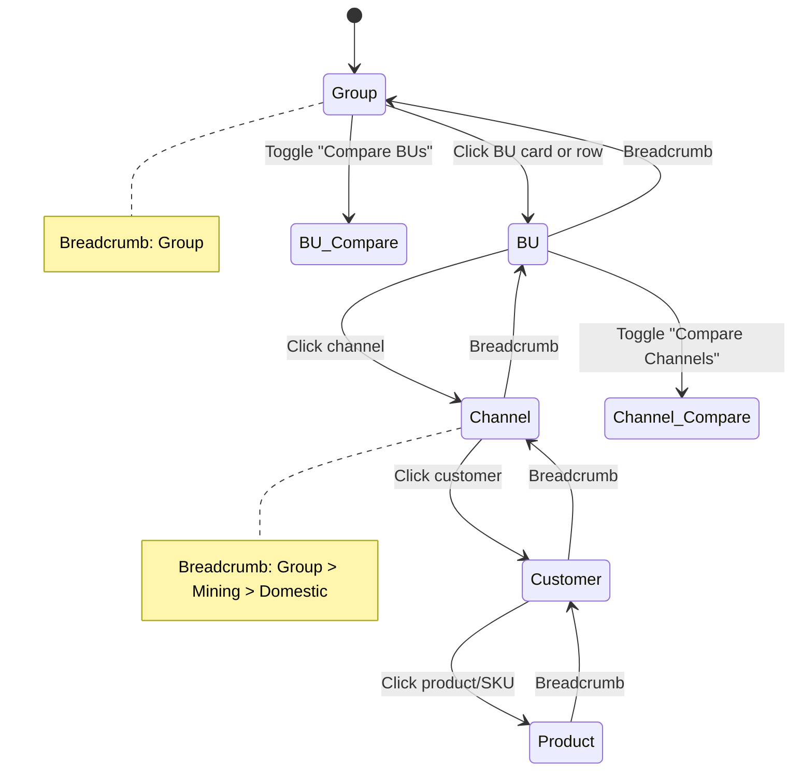
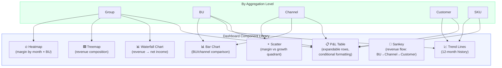
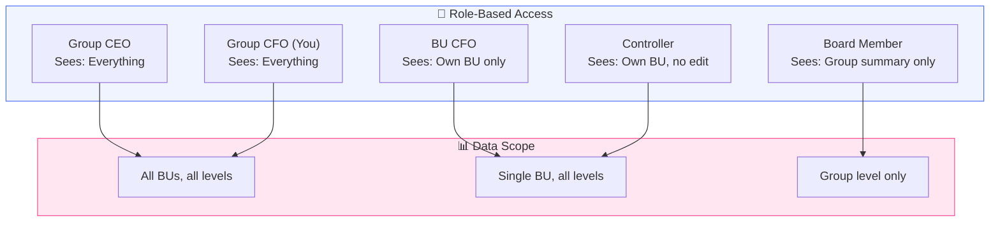

# 📊 P&L Dashboard Template — Design Decisions

> Every line on a P&L is a decision. So is every line on a P&L *dashboard*.

This document captures what needs to be decided to build a P&L dashboard template that works at every aggregation level — from Group consolidated down to individual SKU.

---

## 1. P&L Structure — What Lines to Show

The dashboard template must render a consistent P&L structure at every drill-down level. The question is: **how detailed?**

### Option A: Management P&L (Recommended for v1)

```
Revenue
  ├── Gross Revenue
  └── Discounts & Returns
= Net Revenue
─────────────────────────
Cost of Goods Sold (COGS)
  ├── Direct Materials
  ├── Direct Labor
  ├── Production Overhead
  └── Freight / Logistics
= Gross Profit
─────────────────────────
Operating Expenses (OPEX)
  ├── Sales & Marketing
  ├── General & Administrative
  ├── R&D / Technology
  └── Depreciation & Amortization
= EBITDA
= Operating Income (EBIT)
─────────────────────────
Other Income / (Expense)
  ├── Interest Income
  ├── Interest Expense
  ├── FX Gains / (Losses)
  └── Other
= Profit Before Tax
─────────────────────────
Income Tax
= Net Income
```

### Option B: Statutory P&L (PSAK / IFRS format)
- More rigid, fewer management-useful subtotals
- Better for board packs / external reporting
- Can be generated from the same data

### Option C: Contribution Margin P&L (Best for Channel/Customer/SKU levels)

```
Revenue
- Variable Costs (COGS, variable S&M, commissions)
= Contribution Margin
- Allocated Fixed Costs
= Segment Profit
```

### 📌 Decision Needed

> **Which P&L format should be the default template?**
>
> Recommendation: **Management P&L (Option A) for Group/BU levels**, switching to **Contribution Margin (Option C) at Channel/Customer/SKU levels** — because fixed cost allocation at SKU level is usually meaningless.

---

## 2. Comparison Columns — What to Compare Against

At each level, the P&L should show actuals *plus* comparisons. Options:



### Default Column Layout (Recommended)

| Column | Monthly View | YTD View |
|--------|-------------|----------|
| Actual | ✅ | ✅ |
| Budget | ✅ | ✅ |
| Δ Budget (%) | ✅ | ✅ |
| Prior Year | ✅ | ✅ |
| Δ Prior Year (%) | ✅ | ✅ |
| Prior Month | ✅ | ❌ |
| Forecast | Optional | Optional |

### 📌 Decision Needed

> **Do you maintain budgets at the BU level? Channel level? Product level?**
>
> Budget comparison is only useful where budgets exist. If budgets are only at BU level, lower drill-downs should show Prior Year and Prior Month comparisons instead.

> **Do you do rolling forecasts (Latest Estimate / LE)?**
>
> If yes, this becomes the most important comparison column — more relevant than static annual budgets after Q1.

---

## 3. Time Dimensions — Period Flexibility



### 📌 Decisions Needed

> **What's the fiscal year?** Calendar year (Jan-Dec) or different? Some conglomerates use Apr-Mar.

> **What's the fastest data refresh?** If monthly close takes 15 days, showing "March actuals" on March 5 is misleading. Options:
> - Show "Preliminary" / "Final" badge
> - Only show closed periods
> - Show real-time for revenue, monthly for costs

---

## 4. KPI Header Cards — At-a-Glance Metrics

Above the P&L table, show 4-6 KPI cards. These should change by level:

### Group Level
| KPI | Visual |
|-----|--------|
| Group Revenue | Number + MoM trend arrow |
| Group EBITDA | Number + margin % |
| Group Net Income | Number + YoY change |
| Budget Attainment | % + traffic light |
| Cash Position | Number (if treasury data available) |
| Working Capital Days | DSO + DPO + DIO |

### BU Level
| KPI | Visual |
|-----|--------|
| BU Revenue | Number + trend |
| Gross Margin % | Number + vs budget |
| EBITDA Margin % | Number + trend |
| Revenue per Employee | If HR data available |
| **Sector-specific:** | |
| ├── Mining: $/ton, strip ratio, ASP | |
| ├── Finserv: NIM, NPL ratio, BOPO | |
| └── Digital: MRR, CAC, LTV | |

### Channel Level
| KPI | Visual |
|-----|--------|
| Channel Revenue | Number + share of BU |
| Contribution Margin % | Number + trend |
| Customer Count | Active customers |
| Avg Revenue per Customer | Number + trend |

### Customer Level
| KPI | Visual |
|-----|--------|
| Customer Revenue | Number + trend |
| Customer Margin | % + absolute |
| Revenue Concentration | % of channel/BU total |
| Payment Terms / DSO | Days |

### Product/SKU Level
| KPI | Visual |
|-----|--------|
| SKU Revenue | Number + trend |
| Unit Volume | Number + trend |
| Average Selling Price | Number + trend |
| Unit Margin | $/unit + % |

### 📌 Decision Needed

> **Which sector-specific KPIs matter most?** The mining vs finserv vs digital BUs will need different KPI sets. I need to know which BUs are in scope to design the right cards.

---

## 5. Drill-Down Behavior — How Navigation Works



### Navigation Patterns

| Pattern | Description | Recommendation |
|---------|-------------|----------------|
| **Click-to-drill** | Click a BU name in the P&L to enter that BU | ✅ Primary |
| **Breadcrumb** | Always visible: `Group > BU A > Channel X > Customer Y` | ✅ Required |
| **Side-by-side** | Compare two BUs / channels / customers | ✅ Nice to have |
| **Cross-cut** | View all channels across all BUs (matrix view) | Phase 2 |
| **Bookmark** | Save a specific drill-down path (e.g., always land on Mining > Export) | Phase 2 |

### 📌 Decision Needed

> **Should the default landing page be Group level, or a specific BU?**
>
> If you mostly care about 1-2 BUs daily, landing directly on your primary BU saves clicks.

---

## 6. Visual Components Per Level



### Recommended Chart-to-Level Mapping

| Component | Group | BU | Channel | Customer | SKU |
|-----------|:-----:|:--:|:-------:|:--------:|:---:|
| P&L Table (expandable) | ✅ | ✅ | ✅ | ✅ | ✅ |
| KPI Header Cards | ✅ | ✅ | ✅ | ✅ | ✅ |
| Revenue Waterfall | ✅ | ✅ | ❌ | ❌ | ❌ |
| 12-Month Trend | ✅ | ✅ | ✅ | ✅ | ✅ |
| Composition Treemap | ✅ | ✅ | ❌ | ❌ | ❌ |
| Margin Heatmap | ✅ | ✅ | ❌ | ❌ | ❌ |
| Comparison Bar Chart | ✅ | ❌ | ✅ | ✅ | ✅ |
| Growth vs Margin Scatter | ❌ | ✅ | ✅ | ✅ | ✅ |
| Revenue Flow Sankey | ✅ | ✅ | ❌ | ❌ | ❌ |

---

## 7. Conditional Formatting & Alerts

### Color Rules

| Condition | Color | Applies To |
|-----------|-------|------------|
| Actual ≥ Budget | 🟢 Green | Variance columns |
| Actual < Budget by 0-10% | 🟡 Amber | Variance columns |
| Actual < Budget by >10% | 🔴 Red | Variance columns |
| Margin improving MoM | 🟢 Green | Margin % cells |
| Margin declining MoM | 🔴 Red | Margin % cells |
| Revenue growth > 20% YoY | 🔵 Blue highlight | Revenue rows |
| Negative margin | ⚫ Bold red | Margin cells |

### Inline Alerts (Badges on the Dashboard)

```
⚠️  EBITDA margin below 15% — BU Mining (was 22% in prior month)
📉  Channel Export revenue down 18% MoM
🔴  Customer ABC: negative contribution margin for 3 consecutive months
📊  SKU-042: volume up 40% but margin shrinking — check pricing
```

### 📌 Decision Needed

> **What are YOUR red-line thresholds?**
> - At what margin level does a BU need attention?
> - What budget miss % triggers an alert?
> - What MoM revenue decline % is "normal volatility" vs "call someone"?

---

## 8. Currency & FX Handling

For a multi-BU group with international exposure:

| Scenario | Approach |
|----------|----------|
| All BUs report in IDR | Simple — single currency |
| Some BUs report in USD (e.g., mining exports) | Convert at: (a) transaction rate, (b) monthly average, (c) closing rate |
| Consolidated in IDR | Group view always IDR, toggle to USD |
| FX impact analysis | Show: operational result (constant FX) vs reported (actual FX) |

### 📌 Decision Needed

> **What's the functional currency for each BU?**
> **Do you want a "constant currency" toggle to strip out FX noise?**

---

## 9. Access Control — Who Sees What



### Implementation

Using Supabase RLS:
- Each user has a `role` and `bu_access[]` array
- RLS policies filter `fact_pnl_line_item` by `bu_id IN (user.bu_access)`
- Group-level aggregations only available to Group roles

### 📌 Decision Needed

> **Is this just for you initially, or do BU CFOs/controllers need access from day one?**
>
> If just you → skip RLS complexity in v1, add it when you expand access.

---

## 10. Export & Sharing

| Feature | Priority |
|---------|----------|
| Export P&L to Excel (.xlsx) | P0 — everyone wants this |
| Export to PDF (board-ready) | P1 — for board packs |
| Share a link to a specific view | P1 — "look at this" to BU CFO |
| Schedule email delivery (weekly P&L) | P2 — automation |
| Embed in Google Slides | P3 — nice to have |

---

## Summary of All Decisions Needed

| # | Decision | Impact | Default if No Answer |
|---|----------|--------|---------------------|
| 1 | P&L format per level | Template design | Management P&L (top) + Contribution Margin (bottom) |
| 2 | Budget granularity | Comparison columns | Budget at BU level, PY at lower levels |
| 3 | Rolling forecast (LE)? | Column count | No forecast column in v1 |
| 4 | Fiscal year | Time dimension | Calendar year (Jan-Dec) |
| 5 | Data refresh speed | "Preliminary" badges | Monthly closed figures only |
| 6 | Sector-specific KPIs | Header cards | Generic financial KPIs only |
| 7 | Default landing page | UX | Group consolidated |
| 8 | Red-line thresholds | Alert system | 10% budget miss, 15% margin floor |
| 9 | Functional currencies | FX handling | All IDR, no FX toggle |
| 10 | Access scope (v1) | Auth complexity | Single user (you), no RLS |
| 11 | Number of BUs in v1 | Scope | 2-3 pilot BUs |

---

*Each decision above can be revisited. The dashboard template is designed to be configurable — these are defaults, not concrete.*
