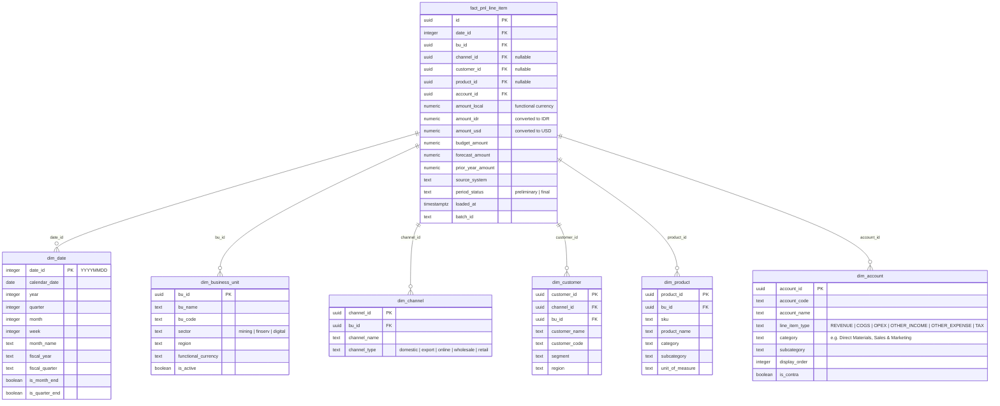

# 🗄️ Data Model & Schema

## Star Schema Overview



---

## Dimension Details

### dim_business_unit

Represents each operating entity in the group.

```sql
CREATE TABLE dim_business_unit (
    bu_id       UUID PRIMARY KEY DEFAULT gen_random_uuid(),
    bu_name     TEXT NOT NULL,
    bu_code     TEXT NOT NULL UNIQUE,
    sector      TEXT NOT NULL CHECK (sector IN ('mining', 'finserv', 'digital', 'other')),
    region      TEXT,
    functional_currency TEXT DEFAULT 'IDR',
    parent_bu_id UUID REFERENCES dim_business_unit(bu_id),  -- for sub-BUs
    is_active   BOOLEAN DEFAULT true,
    created_at  TIMESTAMPTZ DEFAULT now()
);
```

**Note:** `parent_bu_id` supports hierarchical BU structures (e.g., Mining Holding → Coal Sub → Nickel Sub).

### dim_channel

How revenue reaches customers. BU-specific.

```sql
CREATE TABLE dim_channel (
    channel_id   UUID PRIMARY KEY DEFAULT gen_random_uuid(),
    bu_id        UUID NOT NULL REFERENCES dim_business_unit(bu_id),
    channel_name TEXT NOT NULL,
    channel_type TEXT NOT NULL,
    is_active    BOOLEAN DEFAULT true,
    UNIQUE(bu_id, channel_name)
);
```

### dim_customer

Customers are scoped to a channel within a BU.

```sql
CREATE TABLE dim_customer (
    customer_id   UUID PRIMARY KEY DEFAULT gen_random_uuid(),
    channel_id    UUID REFERENCES dim_channel(channel_id),
    bu_id         UUID NOT NULL REFERENCES dim_business_unit(bu_id),
    customer_name TEXT NOT NULL,
    customer_code TEXT,
    segment       TEXT,  -- e.g. enterprise, SME, retail
    region        TEXT,
    is_active     BOOLEAN DEFAULT true
);
```

### dim_product

Products/SKUs. BU-specific (coal tonnage vs loan products vs SaaS licenses).

```sql
CREATE TABLE dim_product (
    product_id    UUID PRIMARY KEY DEFAULT gen_random_uuid(),
    bu_id         UUID NOT NULL REFERENCES dim_business_unit(bu_id),
    sku           TEXT NOT NULL,
    product_name  TEXT NOT NULL,
    category      TEXT,     -- e.g. Thermal Coal, Working Capital Loan
    subcategory   TEXT,     -- e.g. 4200 GAR, 5000 GAR
    unit_of_measure TEXT,   -- tons, units, contracts
    is_active     BOOLEAN DEFAULT true,
    UNIQUE(bu_id, sku)
);
```

### dim_account — The Chart of Accounts Backbone

```sql
CREATE TABLE dim_account (
    account_id     UUID PRIMARY KEY DEFAULT gen_random_uuid(),
    account_code   TEXT NOT NULL UNIQUE,
    account_name   TEXT NOT NULL,
    line_item_type TEXT NOT NULL CHECK (line_item_type IN (
        'REVENUE', 'COGS', 'OPEX', 'OTHER_INCOME', 'OTHER_EXPENSE', 'TAX'
    )),
    category       TEXT,      -- e.g. Direct Materials, Sales & Marketing
    subcategory    TEXT,      -- e.g. Fuel, Explosives, Media Spend
    display_order  INTEGER,   -- controls P&L rendering order
    is_contra      BOOLEAN DEFAULT false,  -- e.g. sales discounts
    sign_convention INTEGER DEFAULT 1      -- 1 for natural, -1 for contra
);
```

### COA Mapping Table

Maps source system account codes to the unified chart:

```sql
CREATE TABLE mapping_chart_of_accounts (
    id                UUID PRIMARY KEY DEFAULT gen_random_uuid(),
    bu_id             UUID NOT NULL REFERENCES dim_business_unit(bu_id),
    source_account_code TEXT NOT NULL,
    source_account_name TEXT,
    target_account_id UUID NOT NULL REFERENCES dim_account(account_id),
    notes             TEXT,
    UNIQUE(bu_id, source_account_code)
);
```

---

## Fact Table Details

### fact_pnl_line_item

The central fact table. One row = one P&L line item for a given period and dimensional intersection.

```sql
CREATE TABLE fact_pnl_line_item (
    id              UUID PRIMARY KEY DEFAULT gen_random_uuid(),
    date_id         INTEGER NOT NULL REFERENCES dim_date(date_id),
    bu_id           UUID NOT NULL REFERENCES dim_business_unit(bu_id),
    channel_id      UUID REFERENCES dim_channel(channel_id),       -- NULL = not channel-specific
    customer_id     UUID REFERENCES dim_customer(customer_id),     -- NULL = not customer-specific
    product_id      UUID REFERENCES dim_product(product_id),       -- NULL = not product-specific
    account_id      UUID NOT NULL REFERENCES dim_account(account_id),

    amount_local    NUMERIC(18,2) NOT NULL,  -- in BU's functional currency
    amount_idr      NUMERIC(18,2) NOT NULL,  -- converted to IDR
    amount_usd      NUMERIC(18,4),           -- converted to USD (optional)

    budget_amount   NUMERIC(18,2),           -- budget for this line
    forecast_amount NUMERIC(18,2),           -- latest estimate / rolling forecast
    prior_year_amount NUMERIC(18,2),         -- same period last year (denormalized for speed)

    source_system   TEXT NOT NULL,            -- 'sap', 'jurnal', 'sheets', etc.
    period_status   TEXT DEFAULT 'preliminary' CHECK (period_status IN ('preliminary', 'final')),
    loaded_at       TIMESTAMPTZ DEFAULT now(),
    batch_id        TEXT                      -- links to ingestion batch for traceability
);

-- Performance indexes
CREATE INDEX idx_pnl_date_bu ON fact_pnl_line_item(date_id, bu_id);
CREATE INDEX idx_pnl_bu_channel ON fact_pnl_line_item(bu_id, channel_id);
CREATE INDEX idx_pnl_bu_account ON fact_pnl_line_item(bu_id, account_id);
CREATE INDEX idx_pnl_loaded ON fact_pnl_line_item(loaded_at);
```

### Granularity Rules

| Level | channel_id | customer_id | product_id |
|-------|-----------|-------------|------------|
| BU total | NULL | NULL | NULL |
| Channel | SET | NULL | NULL |
| Customer | SET | SET | NULL |
| Product/SKU | SET (or NULL) | SET (or NULL) | SET |

**Important:** Data may exist at different granularity levels for different BUs. A mining BU might have channel + customer + product detail, while a finserv BU only has channel-level data initially. The schema supports this — NULL dimensions mean "not broken down further."

---

## Pre-Built Views (Semantic Layer)

### Consolidated P&L View

```sql
CREATE OR REPLACE VIEW v_pnl_consolidated AS
SELECT
    d.year,
    d.month,
    d.month_name,
    a.line_item_type,
    a.category,
    a.account_name,
    a.display_order,
    SUM(f.amount_idr) AS actual,
    SUM(f.budget_amount) AS budget,
    SUM(f.prior_year_amount) AS prior_year,
    SUM(f.amount_idr) - SUM(f.budget_amount) AS budget_variance,
    CASE WHEN SUM(f.budget_amount) != 0
        THEN ROUND((SUM(f.amount_idr) - SUM(f.budget_amount)) / ABS(SUM(f.budget_amount)) * 100, 1)
        ELSE NULL
    END AS budget_variance_pct,
    SUM(f.amount_idr) - SUM(f.prior_year_amount) AS yoy_variance,
    CASE WHEN SUM(f.prior_year_amount) != 0
        THEN ROUND((SUM(f.amount_idr) - SUM(f.prior_year_amount)) / ABS(SUM(f.prior_year_amount)) * 100, 1)
        ELSE NULL
    END AS yoy_variance_pct
FROM fact_pnl_line_item f
JOIN dim_date d ON f.date_id = d.date_id
JOIN dim_account a ON f.account_id = a.account_id
GROUP BY d.year, d.month, d.month_name, a.line_item_type, a.category, a.account_name, a.display_order
ORDER BY d.year, d.month, a.display_order;
```

### BU P&L View

```sql
CREATE OR REPLACE VIEW v_pnl_by_bu AS
SELECT
    bu.bu_name,
    bu.sector,
    d.year,
    d.month,
    a.line_item_type,
    a.category,
    SUM(f.amount_idr) AS actual,
    SUM(f.budget_amount) AS budget,
    SUM(f.prior_year_amount) AS prior_year
FROM fact_pnl_line_item f
JOIN dim_business_unit bu ON f.bu_id = bu.bu_id
JOIN dim_date d ON f.date_id = d.date_id
JOIN dim_account a ON f.account_id = a.account_id
GROUP BY bu.bu_name, bu.sector, d.year, d.month, a.line_item_type, a.category;
```

### Margin Summary View

```sql
CREATE OR REPLACE VIEW v_margin_summary AS
WITH pnl AS (
    SELECT
        bu.bu_name,
        d.year,
        d.month,
        SUM(CASE WHEN a.line_item_type = 'REVENUE' THEN f.amount_idr ELSE 0 END) AS revenue,
        SUM(CASE WHEN a.line_item_type = 'COGS' THEN f.amount_idr ELSE 0 END) AS cogs,
        SUM(CASE WHEN a.line_item_type = 'OPEX' THEN f.amount_idr ELSE 0 END) AS opex,
        SUM(CASE WHEN a.line_item_type IN ('OTHER_INCOME', 'OTHER_EXPENSE') THEN f.amount_idr ELSE 0 END) AS other,
        SUM(CASE WHEN a.line_item_type = 'TAX' THEN f.amount_idr ELSE 0 END) AS tax
    FROM fact_pnl_line_item f
    JOIN dim_business_unit bu ON f.bu_id = bu.bu_id
    JOIN dim_date d ON f.date_id = d.date_id
    JOIN dim_account a ON f.account_id = a.account_id
    GROUP BY bu.bu_name, d.year, d.month
)
SELECT
    bu_name, year, month,
    revenue,
    revenue + cogs AS gross_profit,  -- COGS is negative
    CASE WHEN revenue != 0 THEN ROUND((revenue + cogs) / revenue * 100, 1) END AS gross_margin_pct,
    revenue + cogs + opex AS ebitda,  -- simplified; add back D&A if tracked separately
    CASE WHEN revenue != 0 THEN ROUND((revenue + cogs + opex) / revenue * 100, 1) END AS ebitda_margin_pct,
    revenue + cogs + opex + other + tax AS net_income,
    CASE WHEN revenue != 0 THEN ROUND((revenue + cogs + opex + other + tax) / revenue * 100, 1) END AS net_margin_pct
FROM pnl;
```

---

## FX Rate Table

```sql
CREATE TABLE fx_rates (
    id          UUID PRIMARY KEY DEFAULT gen_random_uuid(),
    date_id     INTEGER NOT NULL REFERENCES dim_date(date_id),
    from_currency TEXT NOT NULL,
    to_currency   TEXT NOT NULL DEFAULT 'IDR',
    rate_type   TEXT NOT NULL CHECK (rate_type IN ('closing', 'average', 'transaction')),
    rate        NUMERIC(18,6) NOT NULL,
    source      TEXT,
    UNIQUE(date_id, from_currency, to_currency, rate_type)
);
```

---

## Data Quality Constraints

| Constraint | Implementation |
|-----------|---------------|
| No orphan facts | Foreign keys on all dimension references |
| No duplicate loads | UNIQUE on (date_id, bu_id, channel_id, customer_id, product_id, account_id, batch_id) |
| Balanced entries | dbt test: SUM(debits) = SUM(credits) per period per BU |
| Complete periods | dbt test: every BU has data for every month (no gaps) |
| Budget exists | dbt test: budget_amount IS NOT NULL at BU level for current year |
| Valid amounts | CHECK constraint: amount_idr is reasonable (no accidental 1000x) |

---

*Schema is designed to be deployed incrementally. Start with dim_business_unit + dim_account + dim_date + fact_pnl_line_item. Add channel/customer/product dimensions as BU data supports them.*
