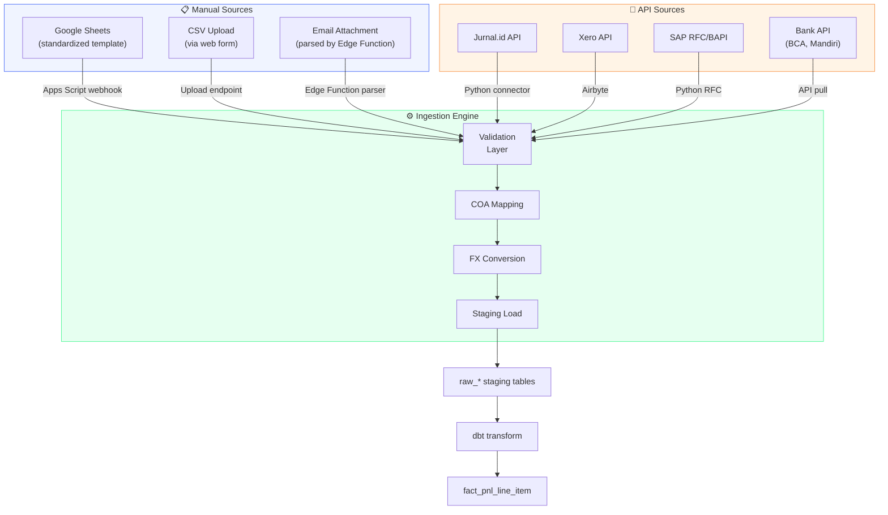
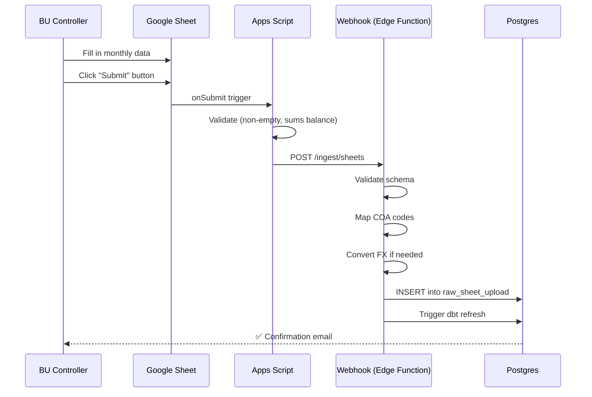
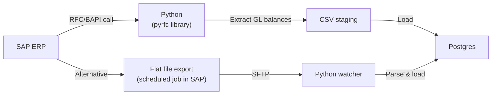
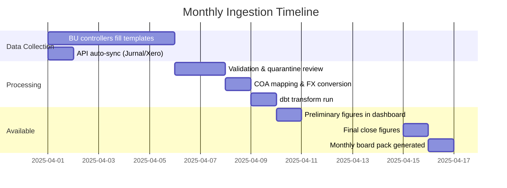

# 📥 Ingestion Guide

## Overview

Data flows from multiple source systems into the warehouse. Each BU may use a different system. This guide covers how to bring data in for each scenario.

---

## Ingestion Architecture



---

## Scenario 1: Google Sheets (Most Likely Starting Point)

For BUs that currently report via spreadsheets — and honestly, this is probably most of them initially.

### Template Design

```
Sheet: "Monthly P&L Upload"
Tab per period: "2025-01", "2025-02", etc.

| Row | Column A        | Column B      | Column C       | Column D    | Column E  |
|-----|-----------------|---------------|----------------|-------------|-----------|
| 1   | BU Code         | MINING-01     |                |             |           |
| 2   | Period           | 2025-03       |                |             |           |
| 3   | Currency         | IDR           |                |             |           |
| 4   | Status           | Final         |                |             |           |
| 5   |                  |               |                |             |           |
| 6   | Account Code    | Account Name  | Channel        | Amount      | Budget    |
| 7   | REV-001         | Coal Sales     | Domestic       | 45000000000 | 42000000000|
| 8   | REV-001         | Coal Sales     | Export         | 32000000000 | 35000000000|
| 9   | REV-002         | Trading Rev    | Domestic       | 8000000000  | 7000000000 |
| 10  | COGS-001        | Fuel           |                | -12000000000| -11000000000|
| 11  | COGS-002        | Labor          |                | -8000000000 | -8500000000|
| ... | ...             | ...            | ...            | ...         | ...       |
```

### Ingestion Flow



### Google Apps Script (Skeleton)

```javascript
function submitPnL() {
  const sheet = SpreadsheetApp.getActiveSheet();
  const buCode = sheet.getRange("B1").getValue();
  const period = sheet.getRange("B2").getValue();
  const currency = sheet.getRange("B3").getValue();
  const status = sheet.getRange("B4").getValue();

  const data = sheet.getRange("A7:E" + sheet.getLastRow()).getValues();

  const payload = {
    bu_code: buCode,
    period: period,
    currency: currency,
    status: status,
    line_items: data.map(row => ({
      account_code: row[0],
      account_name: row[1],
      channel: row[2] || null,
      amount: row[3],
      budget: row[4]
    })).filter(item => item.account_code) // skip empty rows
  };

  const options = {
    method: "post",
    contentType: "application/json",
    payload: JSON.stringify(payload),
    headers: { "Authorization": "Bearer " + INGEST_API_KEY }
  };

  const response = UrlFetchApp.fetch(WEBHOOK_URL, options);
  SpreadsheetApp.getUi().alert("Submitted: " + response.getContentText());
}
```

---

## Scenario 2: Accounting Software API

### Jurnal.id (Popular in Indonesia)

```python
# scripts/ingestion/jurnal_connector.py

import requests
from datetime import datetime

class JurnalConnector:
    BASE_URL = "https://api.jurnal.id/core/api/v1"

    def __init__(self, api_key: str, bu_code: str):
        self.headers = {"apikey": api_key, "Content-Type": "application/json"}
        self.bu_code = bu_code

    def get_trial_balance(self, start_date: str, end_date: str):
        """Fetch trial balance for a period."""
        resp = requests.get(
            f"{self.BASE_URL}/trial_balance",
            headers=self.headers,
            params={"start_date": start_date, "end_date": end_date}
        )
        resp.raise_for_status()
        return resp.json()

    def get_profit_loss(self, start_date: str, end_date: str):
        """Fetch P&L report."""
        resp = requests.get(
            f"{self.BASE_URL}/profit_losses",
            headers=self.headers,
            params={"start_date": start_date, "end_date": end_date}
        )
        resp.raise_for_status()
        return resp.json()

    def transform_to_staging(self, pnl_data: dict) -> list:
        """Transform Jurnal P&L to staging format."""
        rows = []
        for section in pnl_data.get("data", {}).get("list", []):
            for account in section.get("accounts", []):
                rows.append({
                    "bu_code": self.bu_code,
                    "source_account_code": account["number"],
                    "source_account_name": account["name"],
                    "amount": account.get("closing_balance", 0),
                    "source_system": "jurnal"
                })
        return rows
```

### Xero

```python
# scripts/ingestion/xero_connector.py
# Use xero-python SDK or Airbyte Xero connector

# Airbyte approach (recommended — less code):
# 1. Configure Xero source in Airbyte
# 2. Set destination to Postgres (raw_xero_*)
# 3. Schedule daily sync
# 4. dbt transforms raw_xero_* → staging → fact tables
```

---

## Scenario 3: ERP Extract (SAP)

For BUs on SAP:



**Note:** SAP integration complexity depends heavily on the customer's SAP configuration. Two approaches:

1. **Direct RFC** — Python `pyrfc` calls SAP BAPIs (needs SAP admin cooperation)
2. **Flat file** — SAP scheduled job exports GL trial balance to CSV, Python picks it up

Either way, the output maps to the same staging table format.

---

## Staging Table Schema

All sources land in the same staging format:

```sql
CREATE TABLE raw_pnl_upload (
    id              UUID PRIMARY KEY DEFAULT gen_random_uuid(),
    batch_id        TEXT NOT NULL,          -- unique per upload
    bu_code         TEXT NOT NULL,
    period          TEXT NOT NULL,          -- 'YYYY-MM'
    currency        TEXT DEFAULT 'IDR',
    source_system   TEXT NOT NULL,          -- 'sheets', 'jurnal', 'sap', etc.
    source_account_code TEXT NOT NULL,
    source_account_name TEXT,
    channel_name    TEXT,                   -- nullable
    customer_name   TEXT,                   -- nullable
    product_sku     TEXT,                   -- nullable
    amount          NUMERIC(18,2) NOT NULL,
    budget_amount   NUMERIC(18,2),
    period_status   TEXT DEFAULT 'preliminary',
    uploaded_by     TEXT,
    uploaded_at     TIMESTAMPTZ DEFAULT now(),
    validated       BOOLEAN DEFAULT false,
    validation_errors JSONB
);
```

---

## Validation Rules

```python
# scripts/ingestion/validate.py

def validate_upload(rows: list, bu_code: str) -> tuple[list, list]:
    """Returns (valid_rows, error_rows)."""
    valid, errors = [], []

    for row in rows:
        issues = []

        # Required fields
        if not row.get("source_account_code"):
            issues.append("Missing account code")
        if not row.get("amount") and row["amount"] != 0:
            issues.append("Missing amount")

        # Period format
        if not re.match(r"^\d{4}-\d{2}$", row.get("period", "")):
            issues.append(f"Invalid period format: {row.get('period')}")

        # Account code exists in mapping
        if row.get("source_account_code") not in COA_MAPPING.get(bu_code, {}):
            issues.append(f"Unknown account code: {row['source_account_code']}")

        # Reasonable amount (not 1000x off)
        if abs(row.get("amount", 0)) > 1_000_000_000_000:  # > 1 trillion IDR
            issues.append(f"Suspiciously large amount: {row['amount']}")

        if issues:
            row["validation_errors"] = issues
            errors.append(row)
        else:
            valid.append(row)

    return valid, errors
```

---

## Scheduling



### Cron Schedule (Mac Mini)

```bash
# Daily: pull from API-connected BUs
0 6 * * * cd /path/to/cfo-brain && python scripts/ingestion/daily_sync.py

# Daily: check for new Google Sheet submissions
0 7 * * * cd /path/to/cfo-brain && python scripts/ingestion/check_sheets.py

# Daily: run dbt transforms
0 8 * * * cd /path/to/cfo-brain && dbt run --project-dir transforms/

# Daily: run data quality tests
30 8 * * * cd /path/to/cfo-brain && dbt test --project-dir transforms/

# Daily: check alert thresholds
0 9 * * * cd /path/to/cfo-brain && python scripts/alerts/check_thresholds.py
```

---

## Onboarding a New BU

Checklist for adding a new business unit:

```markdown
## BU Onboarding: [BU Name]

- [ ] Add BU to `dim_business_unit`
- [ ] Get BU's chart of accounts
- [ ] Create COA mapping in `mapping_chart_of_accounts`
- [ ] Identify data source (ERP / accounting software / sheets)
- [ ] Set up ingestion pipeline for that source
- [ ] Get 12 months of historical data loaded
- [ ] Load budget data for current year
- [ ] Validate: BU appears correctly in dashboard
- [ ] Validate: P&L totals match BU's own reports
- [ ] Set up recurring ingestion schedule
- [ ] Train BU controller on template (if manual)
- [ ] Add BU-specific KPIs (if applicable)
```

---

*The hardest part of this entire system isn't the code — it's getting clean, consistent data from every BU on time. The ingestion layer is designed to be forgiving (quarantine, not reject) while maintaining quality.*
