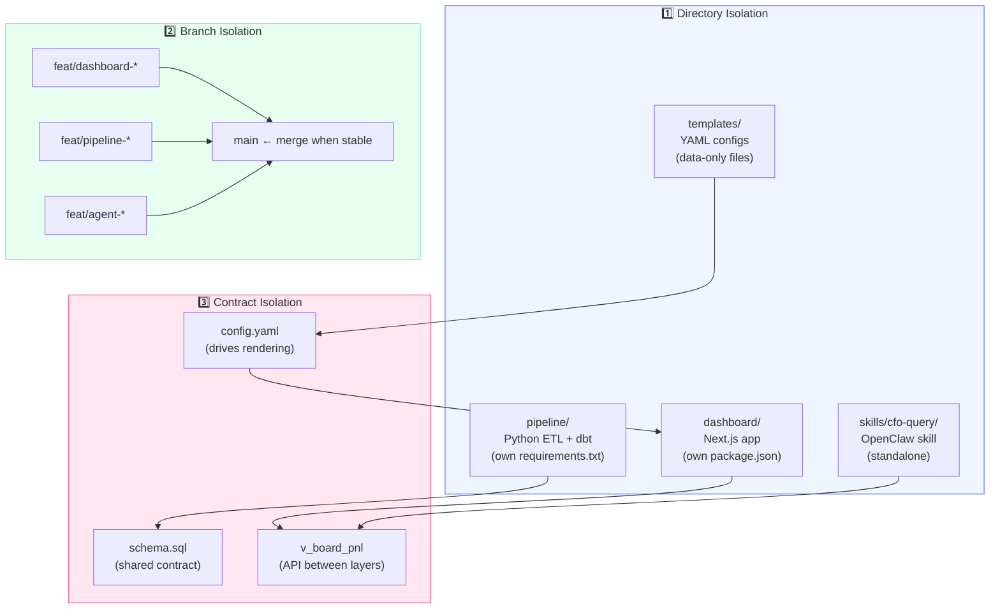
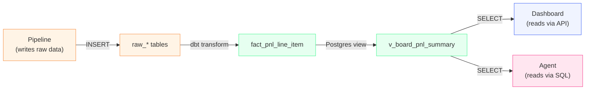
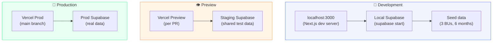

# 🔀 Workstream Isolation — Iterating Without Stepping on Toes

## The Problem

This project has at least 4 parallel workstreams that move at different speeds:

| Workstream | Changes Often | Changes Rarely |
|-----------|---------------|----------------|
| **Dashboard design** | Layout, colors, columns, components | — |
| **Data pipeline** | — | Schema, transforms, ingestion |
| **Agent skill** | Example queries, formatting | Schema reference |
| **Template config** | BU lists, metric panels, thresholds | — |

Dashboard design will iterate 10x faster than the data pipeline. If they're coupled, every UI tweak risks breaking ingestion or vice versa.

---

## Solution: Three Layers of Isolation



---

## 1️⃣ Directory Isolation

Each workstream lives in its own directory with its own dependency management:

```
cfo-brain/
├── dashboard/              # Next.js — dashboard UI
│   ├── package.json
│   ├── src/
│   │   ├── components/     # React components (PnLGrid, KPICard, etc.)
│   │   ├── config/         # Template configs loaded at runtime
│   │   ├── hooks/          # Data fetching hooks
│   │   └── lib/            # Formatting, color logic
│   └── README.md
│
├── pipeline/               # Python — data ingestion + transforms
│   ├── requirements.txt
│   ├── scripts/
│   │   ├── ingest/         # Source-specific ingestion
│   │   ├── validate/       # Validation rules
│   │   └── alerts/         # Threshold checks
│   ├── dbt/                # dbt project (transforms)
│   │   ├── models/
│   │   ├── tests/
│   │   └── dbt_project.yml
│   └── README.md
│
├── skills/                 # OpenClaw — agent skill
│   └── cfo-query/
│       ├── SKILL.md
│       ├── schema.md       # ← reads from shared schema
│       └── examples.md
│
├── templates/              # Config files — shared across layers
│   ├── pillars/
│   │   ├── fs-pillar.yaml
│   │   ├── mining-pillar.yaml
│   │   └── digital-pillar.yaml
│   ├── pnl-structure.yaml  # P&L line item ordering
│   └── thresholds.yaml     # Alert thresholds
│
├── schema/                 # Shared contract
│   ├── tables.sql          # DDL for all tables
│   ├── views.sql           # Materialized views
│   └── seed/               # Reference data (COA mapping, dim_date)
│
└── docs/                   # Architecture & decisions
```

**Rule:** Changes to `dashboard/` cannot require changes to `pipeline/` and vice versa. They communicate only through the database views and config files.

---

## 2️⃣ Branch Isolation

```mermaid
gitgraph
    commit id: "initial architecture"
    branch feat/dashboard-board-template
    commit id: "PnLGrid component"
    commit id: "color coding logic"
    commit id: "period selector"
    checkout main
    branch feat/pipeline-sheets-ingest
    commit id: "Google Sheets connector"
    commit id: "validation rules"
    checkout main
    branch feat/dashboard-export-excel
    commit id: "Excel export"
    checkout main
    merge feat/pipeline-sheets-ingest id: "merge pipeline"
    checkout feat/dashboard-board-template
    commit id: "responsive tweaks"
    checkout main
    merge feat/dashboard-board-template id: "merge dashboard v1"
    branch feat/agent-text-to-sql
    commit id: "cfo-query skill"
    checkout main
    merge feat/agent-text-to-sql id: "merge agent"
    merge feat/dashboard-export-excel id: "merge export"
```

### Branch Naming Convention

| Workstream | Branch Prefix | Example |
|-----------|--------------|---------|
| Dashboard UI | `feat/dashboard-*` | `feat/dashboard-board-template` |
| Pipeline / Data | `feat/pipeline-*` | `feat/pipeline-jurnal-connector` |
| Agent skill | `feat/agent-*` | `feat/agent-trend-queries` |
| Schema changes | `feat/schema-*` | `feat/schema-add-fx-rates` |
| Config/templates | `feat/config-*` | `feat/config-mining-pillar` |
| Docs | direct to `main` | (low risk) |

### Rules

1. **Dashboard branches never touch `pipeline/` or `schema/`**
2. **Pipeline branches never touch `dashboard/`**
3. **Schema changes get their own branch** because they affect everything
4. **Config changes can go direct to `main`** (they're just YAML, low risk)
5. **Docs go direct to `main`**

---

## 3️⃣ Contract Isolation — The Shared Interface

The key insight: **dashboard and pipeline don't talk to each other. They both talk to the database views.**



### The Contract View

```sql
-- This is the API between pipeline and dashboard
-- Dashboard ONLY reads from this view (never fact tables directly)

CREATE OR REPLACE VIEW v_board_pnl_summary AS
SELECT
    bu.bu_code,
    bu.bu_name,
    bu.sector,
    d.year,
    d.month,
    a.line_item_type,
    SUM(f.amount_usd) AS amount_usd,
    SUM(f.amount_idr) AS amount_idr,
    SUM(f.budget_amount) AS budget_amount,
    SUM(f.prior_year_amount) AS prior_year_amount,
    MAX(f.period_status) AS period_status
FROM fact_pnl_line_item f
JOIN dim_business_unit bu ON f.bu_id = bu.bu_id
JOIN dim_date d ON f.date_id = d.date_id
JOIN dim_account a ON f.account_id = a.account_id
GROUP BY bu.bu_code, bu.bu_name, bu.sector, d.year, d.month, a.line_item_type;
```

**Pipeline team** can change ingestion logic, add new sources, restructure staging tables — as long as the view contract holds, dashboard doesn't break.

**Dashboard team** can redesign every component, change colors, add charts — as long as it reads from the view, pipeline doesn't care.

---

## Practical Workflow: Iterating on Dashboard Design

### "I want to tweak the layout" (10 minutes)

1. Edit `templates/pillars/fs-pillar.yaml` → change column order, add a metric
2. Dashboard re-renders automatically (config-driven)
3. Commit directly to `main` (it's just a YAML file)

### "I want to redesign the P&L grid component" (hours)

1. `git checkout -b feat/dashboard-grid-v2`
2. Work in `dashboard/src/components/PnLGrid/` only
3. Preview on Vercel (auto-deploy per PR)
4. Merge when happy

### "I want to add a new pillar" (30 minutes)

1. Create `templates/pillars/mining-pillar.yaml` (copy fs-pillar, change BU list)
2. Dashboard reads it → new page appears
3. No code change needed

### "I want to change how EBITDA is calculated"

1. `git checkout -b feat/schema-ebitda-calc`
2. Update the view in `schema/views.sql`
3. Update `skills/cfo-query/schema.md` to reflect new definition
4. **This touches the contract** → needs review before merge

---

## Development Environments



### Dashboard Design Iteration Stack

For fast UI iteration without needing real data:

1. **Mock data file** — `dashboard/src/mocks/fs-pillar-mar-2026.json`
   - Copied from the actual screenshot values
   - Dashboard can render in "mock mode" before pipeline exists

2. **Storybook (optional)** — isolate components
   - `PnLGrid` with different data shapes
   - `KPICard` with different values/colors
   - Test color coding edge cases

3. **Config hot-reload** — YAML changes → instant preview
   - No restart, no rebuild

---

## When Workstreams Must Coordinate

| Scenario | Who's Involved | Coordination |
|----------|---------------|--------------|
| New dimension added (e.g., region) | Schema + Pipeline + Dashboard | Schema branch → review → merge → update others |
| New metric panel (e.g., add Net Income) | Config + Dashboard | Config change → dashboard already handles it |
| New BU onboarded | Pipeline + Config | Pipeline loads data → config adds BU to pillar |
| Column formula change | Schema (view) + Agent | Update view → update agent examples |
| New pillar/vertical | Config only | New YAML file, done |

---

## Summary

| Layer | What Changes | Impact Radius | Merge Policy |
|-------|-------------|---------------|--------------|
| **Config (YAML)** | BU lists, colors, thresholds | Dashboard only | Direct to main |
| **Dashboard (React)** | Components, layout, UX | Dashboard only | PR → preview → merge |
| **Pipeline (Python/dbt)** | Ingestion, transforms | Database | PR → test → merge |
| **Schema (SQL)** | Tables, views | Everything | PR → careful review → merge |
| **Agent (Skill)** | Examples, formatting | Agent only | PR → test → merge |
| **Docs** | Documentation | Nothing | Direct to main |

**Golden rule:** If your change is in `dashboard/`, you should never need to touch `pipeline/`. If you do, something is wrong with the contract layer.

---

*The fastest way to iterate on the dashboard is to have mock data and config files ready before the pipeline exists. Build the UI first with fake data, then plug in real data later.*
